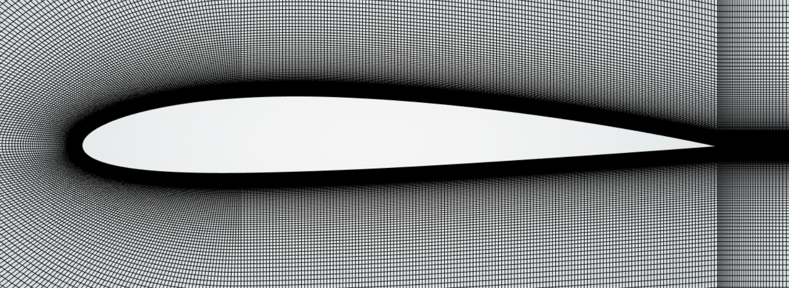

# Vortex-Induced Vibrations (CFD)

## Objective
Investigate unsteady aerodynamic loads and vortex shedding behavior in commercial large scale 15MW wind turbine blades in order to recommend mitigation and pitching strategies.

## Details
- Set up URANS/DES simulations in ANSYS Fluent and analyzed turbulence modelling
- Generated and validated high-quality meshes, conducted mesh study, successfully implemented dynamic meshing and FSI structural modelling
- Worked on lift/drag time histories and flow structures to produce load distributions for further analysis

## Tools Used
ANSYS Fluent, ANSYS Mechanical, MATLAB

## Results

