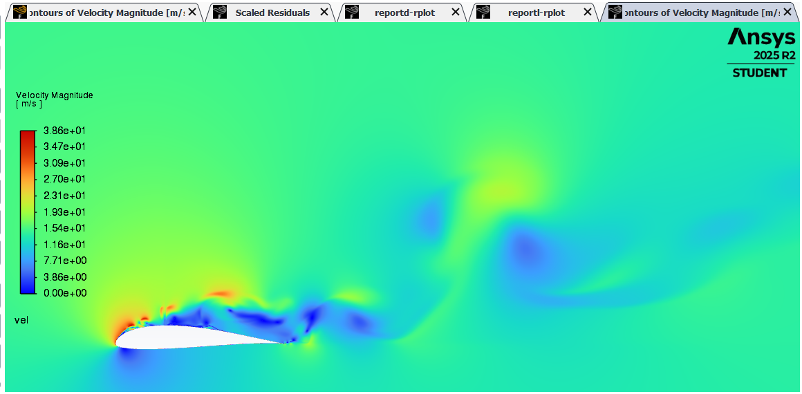
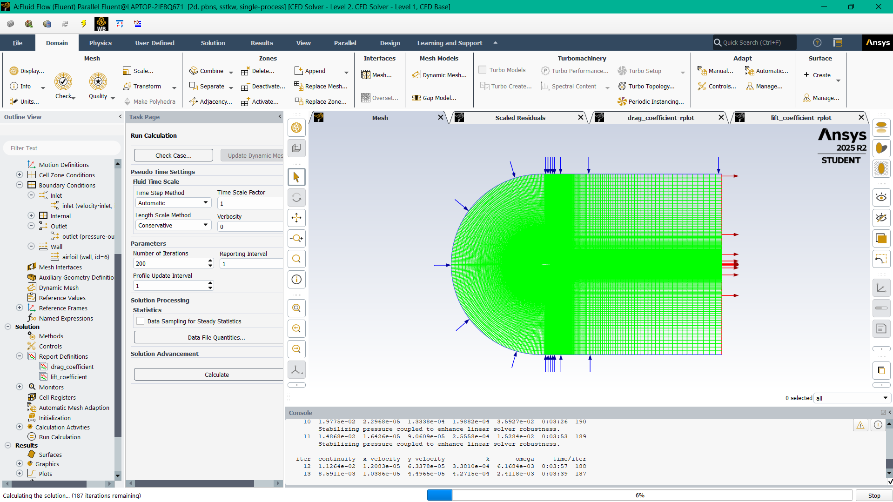

# Vortex-Induced Vibrations (CFD)

## Objective
Investigated unsteady aerodynamic loads caused by vortex shedding behavior in commercial large scale 15MW wind turbine blades in order to recommend mitigation and pitching strategies. 

## Details
- Set up URANS/DES simulations in ANSYS Fluent with dynamic meshing and analyzed turbulence modelling.
- Generated and validated high-quality meshes, conducted mesh study, successfully implemented dynamic meshing and FSI structural modelling.
- Worked on lift/drag time histories and flow structures to produce load distributions for further analysis.
- Perfomed ANSYS Mechanical analysis of obtained lift and drag loads on modelled blade.
- Did parametric study of lift and drag across 5 wind speeds and 5 pitch angles for root stress evaluation.
- Applied ML techniques to smartly predict behaviour at any condition and efficiently recommend pitching strategy for mitigation of VIV.
- Paper abstract accepted in ICSV32

## Tools Used
ANSYS Fluent, ANSYS Mechanical, MATLAB

## Results

