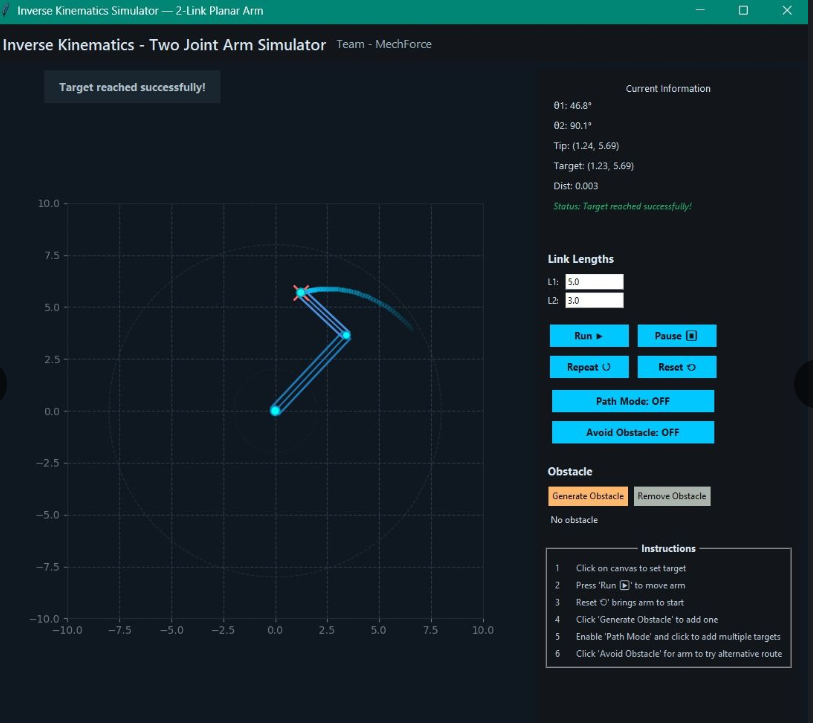

# Robotic Arm Simulator

## Objective
Simulate inverse kinematics and motion planning for a 2-DOF robotic arm.

## Details
- Implemented inverse kinematics in Python with multipath planning, obstacle avoidance and collision detection.
- User friendly GUI and a parallel algorithms running backend
- Won 1st place in AI Student of the Year Hackathon

## Tools Used
Python, NumPy, Matplotlib

## Results

