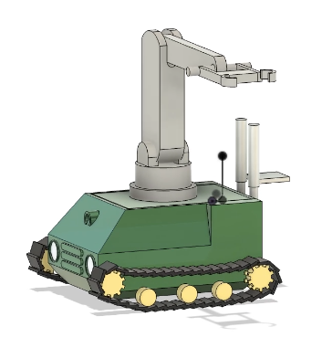

# Urban Rescue Bot – Mechanical Design

## Objective
Design a mechanically constrained rescue robot capable of navigating post-earthquake environments.

## Details
- Won 1st place in IEEE Robotics CAD Competitio
- Developed a complete mechanical CAD model under strict design constraints and 4hours time duration.
- Designed chassis, mobility system, and payload interfaces along with on spot tool assembly system.
- Optimized layout for stability and obstacle traversal.

## Tools Used
Fusion 360

## Results

