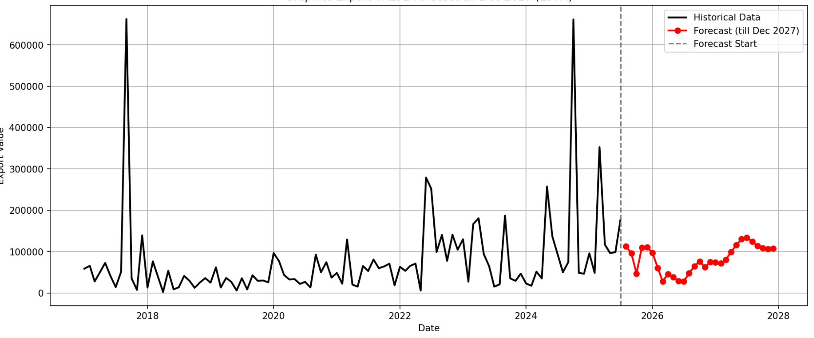
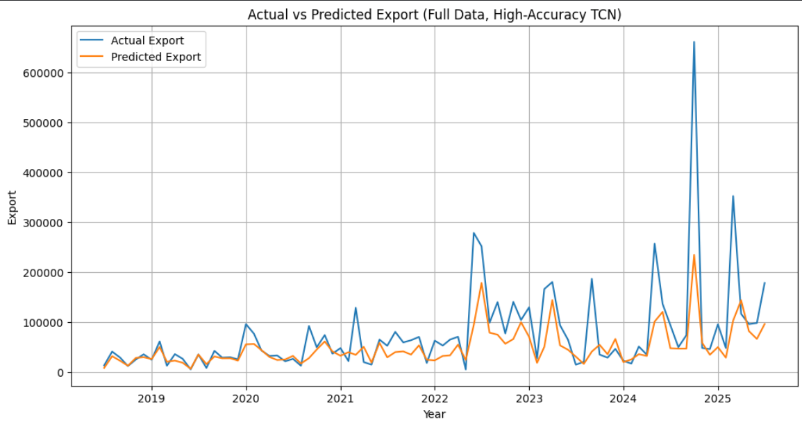
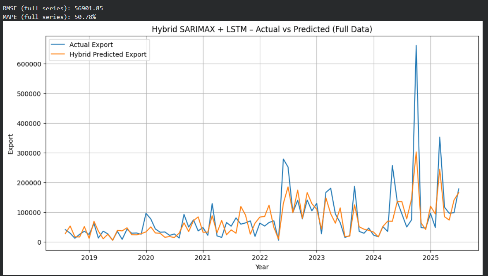

# Time-Series Modeling for Engineering Data

## Objective
Analyze and model time-series data for export import EXIM data prediction and pattern extraction.

## Details
- Preprocessed time-series data and handled import/export pipelines using SARIMAX, LSTM and TCN models
- Evaluated model performance on temporal datasets and predicted future patterns.

## Tools Used
Python, NumPy, Pandas, Matplotlib

## Results

